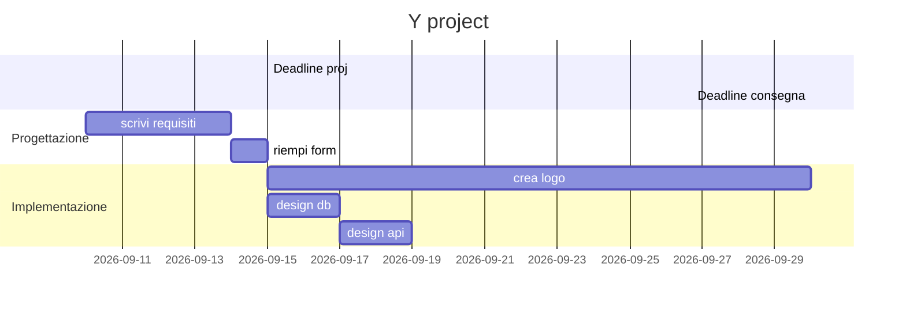

# Analisi del progetto

1. [Desiderata](#desiderata)
1. [Obiettivi](#obiettivi)
1. [Requisiti](#requisiti)
1. [Specifiche](#specifiche)
1. [Project breakdown](#project-breakdown)
1. [Timeline](#timeline)
1. [Costi](#costi)

## Desiderata

1. Creare post con messaggi vocali.
1. Vedere post di altri utenti.
1. Filtrare post per tag e/o per utente.
1. Creare gruppi.

## Obiettivi

## Requisiti

1. Realizzazione di un logo vettoriale.
1. Realizza mockup della pagina.
1. Realizza frontend e backend.

## Specifiche

1. node v24.7.0
1. React + TypeScript + Vite
1. spring boot v3.5.5 / django
1. PostgreSQL

## Project breakdown

## Timeline

## Costi
